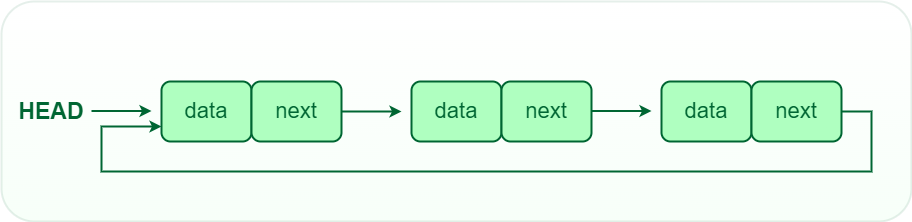

# Linked List

`A Linked List is a linear data structure which looks like a chain of nodes, where each node is a different element. Unlike Arrays, Linked List elements are not stored at a contiguous location.`

- It Conists of nodes, where each node contains data and reference link to another node in the sequence with the help of pointers.

## What are Pointers

Pointers are the connections that hold the pieces of linked structures together.
Pointers represent the address of a location in memory.

- Unlike Arrays, they are dynamic, effecient at insertion and deletion operations.

## Why Linked List

1. Linked List can grow or shrink dynamically
2. Insertion and deletion is simpler than array since it involves change in pointers rather than shifting elements.
3. Linked lists can efficiently utilize memory by allocating space for each element separately

## Use Cases

1. Stacks and Queues: Linked lists are commonly used to implement stacks and queues due to their efficient insertion and deletion operations.
2. Memory Management: Operating systems use linked lists to manage memory allocation and deallocation efficiently.
3. Graphs and Trees: Linked lists are used to represent graphs and trees where each node can have multiple children or neighbors.

## Some common operations that can be performed on a linked list

- Insertion: Adding a new node to the list at a specific position.
- Deletion: Removing a node from the list at a specific position.
- Traversal: Visiting each node in the list in a specific order (e.g., in order, in reverse order, or in a circular fashion).
- Searching: Finding a specific node in the list based on some criteria (e.g., a given value or a specific position).
- Sorting: Reordering the nodes in the list according to some criteria (e.g., alphabetical order or numerical order).
- Merging: Combining two or more linked lists into a single list.
- Reversing: Reversing the order of the nodes in the list.

## Types of Linked Lists

### [Single Linked List](https://www.geeksforgeeks.org/singly-linked-list-definition-meaning-dsa/)

Here, each node contains a reference to the next node in the sequence. Traversing a singly linked list is done in a forward direction.

### [Double Linked List](https://www.geeksforgeeks.org/introduction-and-insertion-in-a-doubly-linked-list/)

Each node contains references to both the next and previous nodes. This allows for traversal in both forward and backward directions,

### [Circular Linked List](https://www.geeksforgeeks.org/circular-linked-list/)

The last node points back to the head node, creating a circular structure. It can be either singly or doubly linked.

